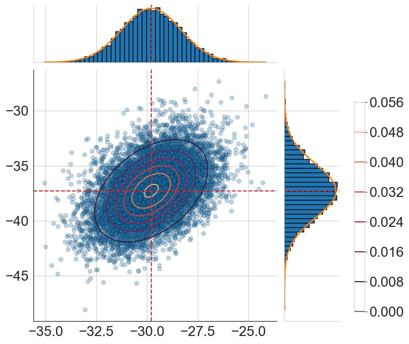
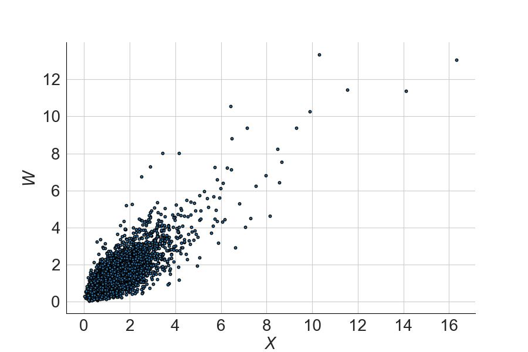
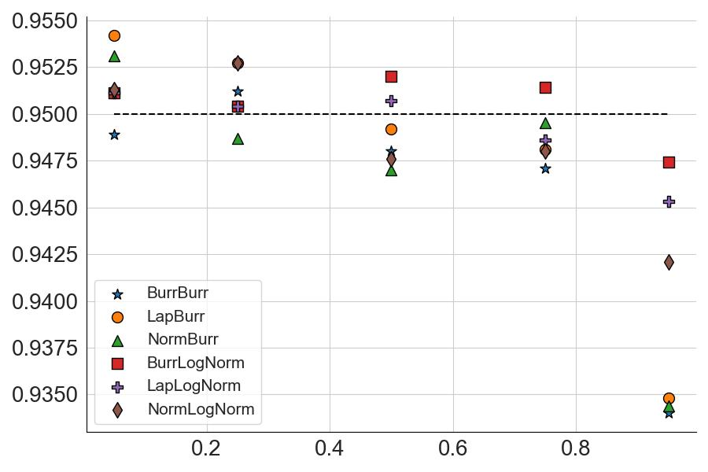
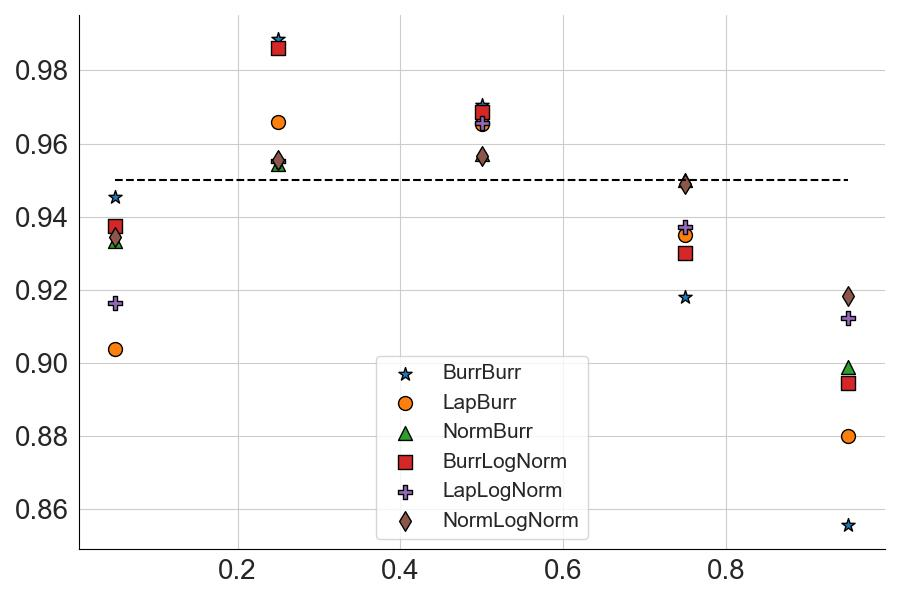
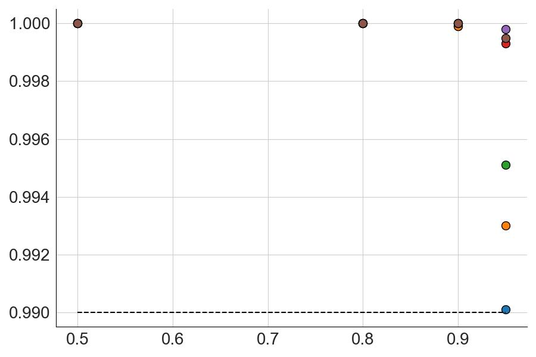

# confidence-region-weighted-quantile
Implementation of the paper **[Confidence Regions for Weighted Quantiles](https://hal.sorbonne-universite.fr/hal-05391451v2)** by Michaël Allouche and [Emmanuel Gobet](http://www.cmap.polytechnique.fr/~gobet/)


# Abstract
Quantiles are fundamental tools in statistics and risk analysis. While asymptotic and finite-sample results for standard 
empirical quantiles are well established, analogous results for weighted quantiles remain scarce. In this paper, we establish 
a comprehensive asymptotic theory for weighted quantiles. We derive a multivariate central limit theorem for multiple 
perturbed weighted quantiles. This result yields, as corollaries, (i) a multivariate CLT for weighted empirical quantiles, 
(ii) a distribution-free confidence interval for weighted quantiles in the spirit of Wilks’ method, and (iii) confidence 
bounds for the weighted expected shortfall.

# Objective
Let $`(X,W)`$ be a random variable taking values in $`\mathbb R \times (0,+\infty)`$. We assume that $`W`$ is positive and integrable: $`\mathbb E[W]<+\infty`$. 
We are concerned with deriving a confidence region of a vector of  $`W`$-weighted quantile of $`X`$
```math
q_W(\alpha_k) :=  \inf\{x\in \mathbb R : \frac{\mathbb E[W\cdot \mathbb 1\{X\leq x\}]}{\mathbb E[W]} \geq \alpha_k\},
```
for quantile levels $`\alpha_k\in (0,1)^K, \, 1\leq k\leq K`$.

<p align="center">
  
</p>

Distribution of the errors between the real weighted quantiles and the estimated confidence
bounds for $`K=2`$ risk levels $`\alpha_1=0.5`$ and $`\alpha_2=0.9`$ based on simulated data. 


# Data
Consider simulated data based on the use of a bivariate Gumbel copula:
```math
    C(u, v) = \exp\left[-\left\{(\log 1/u)^\theta + (\log 1/v)^\theta\right\}^{1/\theta}\right], \quad (u,v)\in(0,1]^2,\quad \theta>0,
```
where the two margins of $`X`$ and $`W`$ are chosen in `simulation/DICT_SCENARIOS` (see Table 1)
```python
DICT_SCENARIOS = {
    1: [st.burr12(c=1/0.3, d=1), st.burr12(c=1/0.3, d=1)], 
    2: [st.laplace(loc=0, scale=1), st.burr12(c=1/0.3, d=1)],
    3: [st.norm(loc=0, scale=1), st.burr12(c=1/0.3, d=1)],
    4: [st.burr12(c=1/0.3, d=1), st.lognorm(s=0.5)],
    5: [st.laplace(loc=0, scale=1), st.lognorm(s=0.5)],
    6: [st.norm(loc=0, scale=1), st.lognorm(s=0.5)],
}
```
and where the dependence structure is modeled with a fixed $`\theta=2`$:
```python
from simulation import data_simulation
X, W = data_simulation(scenario=1, n=10000, theta=2)
```


# Coverage Probability - Weighted Quantile
## Wilks-type method
Based on Theorem 2.3, a data driven confidence interval at confidence level $\eta$ for the weighted quantile  $q_{\tt W}(\alpha)$ is

```math
    \hat I_{n,\eta}:=\Big[\widehat{q_{{\tt W},n}}(\alpha^-_{n,\eta}),\, \widehat{q_{{\tt W},n}}(\alpha^+_{n,\eta})\Big],
```
 with the translated risk levels $\alpha^-_{n,\eta} = (\alpha-\frac{\gamma^{\downarrow,n} }{\sqrt n}c_\eta)\vee 0$ and $\alpha^+_{n,\eta} = (\alpha+\frac{\gamma^{\uparrow,n}}{\sqrt n} c_\eta)\wedge 1 $, and

```math
    c_\eta:=\Phi^{-1}(1-\frac{1-\eta}{2}), \quad
    \gamma^{\downarrow,n}=\gamma^{\uparrow,n} := \frac{\hat\sigma_n}{\frac 1n\sum_{i=1}^n W_i}, \quad {\hat\sigma_n:=\sqrt{\frac{1}{n }\sum_{i=1}^nW_i^2\left(\alpha-\mathbb 1_{X_i\leq \widehat{q_{{\tt W},n}}(\alpha)}\right)^2}.}
```

The confidence interval is computed from the function `models.py`with
```python
ci_left, ci_right, qW_hat = confidence_interval_qW(X, W, alpha, eta)
```

Fitting the confidence intervals for multiple replications with the `fit_ci()` method allows to obtain the coverage 
probability for the **weighted quantile** with $`\alpha\in\{0.05, 0.25, 0.5, 0.75, 0.95\}`$, $`\eta=0.95`$ and $`n=1000`$:




## Density plug-in method
A proposed extension of the simulation study is to compare our proposed Wilks-based confidence interval estimator of the weighted quantile with a density plug-in competitor based on the CLT derived in Theorem 2.1.
Based on this result, one can derive an empirical density-based confidence interval
```math
    \hat I^{\rm D}_{n,\eta,h} := [\widehat{q_{{\tt W},n}}(\alpha) - \frac{\hat S_{n,h}}{\sqrt{n}}c_\eta, \widehat {q_{{\tt W},n}}(\alpha) + \frac{\hat S_{n,h}}{\sqrt{n}}c_\eta]
```

with
```math
\hat S_{n,h} := \frac{\hat\sigma_n}{\frac{1}{n}\sum_{i=1}^n W_i\hat f_{{\tt W},n,h}(\widehat {q_{{\tt W},n}}(\alpha))}, \qquad \hat\sigma_n:=\sqrt{\frac{1}{n }\sum_{i=1}^nW_i^2\left(\alpha-\mathbb 1_{X_i\leq \widehat {q_{{\tt W},n}}(\alpha)}\right)^2},
```
the empirical counterpart of the standard-deviation and 
$$\hat f_{{\tt W},n,h}(x) := \frac{1}{h\sqrt{2\pi}}\sum_{i=1}^n \omega_i\exp\left(-\frac{(X_i-x)^2}{2h^2}\right),$$
a kernel density estimator using a Gaussian kernel, normalized weights $\{\omega_i=W_i/\sum_{j=1}^nW_j\}_{i=1}^n$ and a bandwidth $h>0$. 

The confidence interval is computed from the function `models.py`with
```python
ci_left, ci_right, qW_hat = confidence_interval_qW_density(X_samples, W_samples, alpha, eta)
```

Fitting the confidence intervals for multiple replications with the `fit_ci()` method allows to obtain another coverage 
probability for the **weighted quantile** with $`\alpha\in\{0.05, 0.25, 0.5, 0.75, 0.95\}`$, $`\eta=0.95`$ and $`n=1000`$:




The estimated confidence interval of our proposed method provides better
coverage probabilities for all risk levels and sample size considered.


# Coverage Probability - Expected Shortfall
The confidence interval for the weighted expected shortfall (cf Theorem 2.5) is computed
from the function `models.py`with
```python
ci_left, ci_right, esW_hat = confidence_interval_esW(X, W, alpha, eta)
```
Fitting the confidence intervals for multiple replications with the `fit_ci()` method allows to obtain the coverage 
probability for the **weighted expected shortfall** with $`\alpha\in\{0.5, 0.8, 0.9, 0.95\}`$ and $`\eta=0.99`$:




# Cite
```bibtex
@article{allouche2025confidence,
  title={Confidence regions for weighted quantiles},
  author={Allouche, Micha{\"e}l and Gobet, Emmanuel},
  year={2025}
}
```

