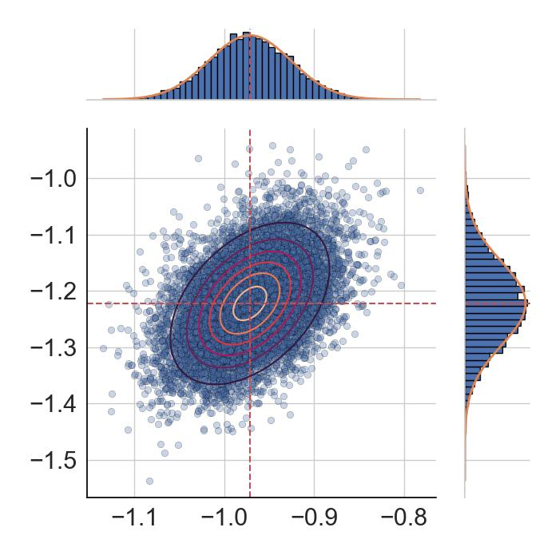
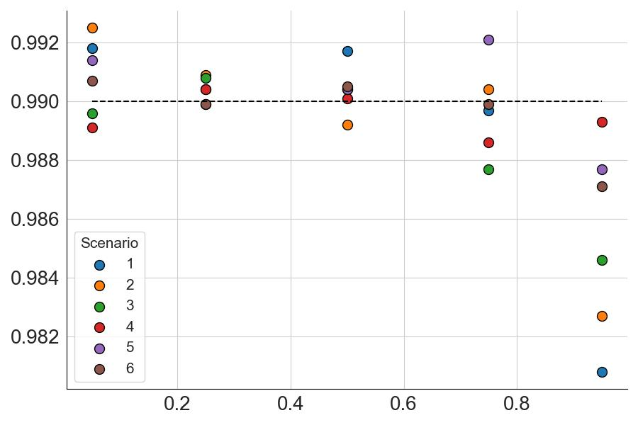

# confidence-region-weighted-quantile
Implementation of the paper **Confidence Regions for Weighted Quantiles** by Michaël Allouche and [Emmanuel Gobet](http://www.cmap.polytechnique.fr/~gobet/)


## Abstract
Quantiles are fundamental tools in statistics and risk analysis. While asymptotic and finite-sample results for standard 
empirical quantiles are well established, analogous results for weighted quantiles remain scarce. In this paper, we establish 
a comprehensive asymptotic theory for weighted quantiles. We derive a multivariate central limit theorem for multiple 
perturbed weighted quantiles. This result yields, as corollaries, (i) a multivariate CLT for weighted empirical quantiles, 
(ii) a distribution-free confidence interval for weighted quantiles in the spirit of Wilks’ method, and (iii) confidence 
bounds for the weighted expected shortfall.

## Objective
Let $`(X,W)`$ be a random variable taking values in $`\mathbb R \times (0,+\infty)`$. {We assume that $`W`$ is positive and integrable: $`\mathbb E[W]<+\infty`$. 
We are concerned with deriving a confidence region of a vector of  $`W`$-weighted quantile of $`X`$
```math
q_W(\alpha_k) :=  \inf\set{x\in \mathbb R : \frac{\mathbb E[W\cdot \mathbb 1\{X\leq x\}]}{\mathbb E[W]} \geq \alpha_k},
```
for quantile levels $`\alpha_k\in (0,1)^K`$.

<p align="center">
  
</p>

Distribution of the errors between the real weighted quantiles and the estimated confidence
bounds for $`K=2`$ risk levels $`\alpha_1=0.5`$ and $`\alpha_2=0.9`$ based on simulated data. 


## Data
Consider simulated data based on the use of a bivariate Gumbel copula:
```math
    C(u, v) = \exp\left[-\left\{(\log 1/u)^\theta + (\log 1/v)^\theta\right\}^{1/\theta}\right], \quad (u,v)\in(0,1]^2,\quad \theta>0,
```
where the two margins of $`X`$ and $`W`$ are chosen in `simulation/DICT_SCENARIOS` (see Table 1)
```
DICT_SCENARIOS = {
    1: [st.burr12(c=1/0.3, d=1), st.burr12(c=1/0.3, d=1)], 
    2: [st.laplace(loc=0, scale=1), st.burr12(c=1/0.3, d=1)],
    3: [st.norm(loc=0, scale=1), st.burr12(c=1/0.3, d=1)],
    4: [st.burr12(c=1/0.3, d=1), st.lognorm(s=0.5)],
    5: [st.laplace(loc=0, scale=1), st.lognorm(s=0.5)],
    6: [st.norm(loc=0, scale=1), st.lognorm(s=0.5)],
}
```
and where the dependence structure is modeled with a fixed $`\theta=2`$:
```
from simulation import data_simulation
X, W = data_simulation(scenario=1, n=10000, theta=2)
```


## Coverage Probability

The confidence interval for the univariate weighted quantile (cf Corollary 2.4) and the weighted expected shortfall (cf Corollary 2.6) are computed respectively
from the function `models.py`with
```
ci_left, ci_right, qW_hat = confidence_interval_qW(X, W, alpha=0.99, eta=0.99)
```
and 
```
ci_left, ci_right, esW_hat = confidence_interval_esW(X, W, alpha=0.95, eta=0.95, s=3)
```
where `alpha` is the risk level and `eta` is the confidence level. 

Fitting the confidence intervals for multiple replications with the `fit_ci()` method allows to obtain the coverage 
probability for the **weighted quantile** with $`\alpha\in\{0.05, 0.25, 0.5, 0.75, 0.95\}`$ and $`\eta=0.99`$:



 and for the **weighted expected shortfall** with $`\alpha\in\{0.5, 0.8, 0.9, 0.95\}`$ and $`\eta=0.99`$:
 
